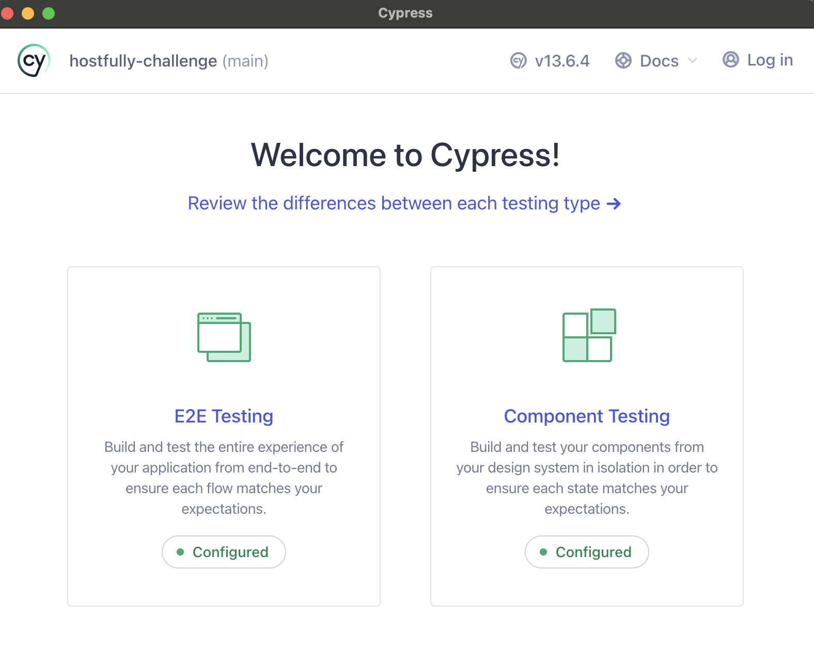
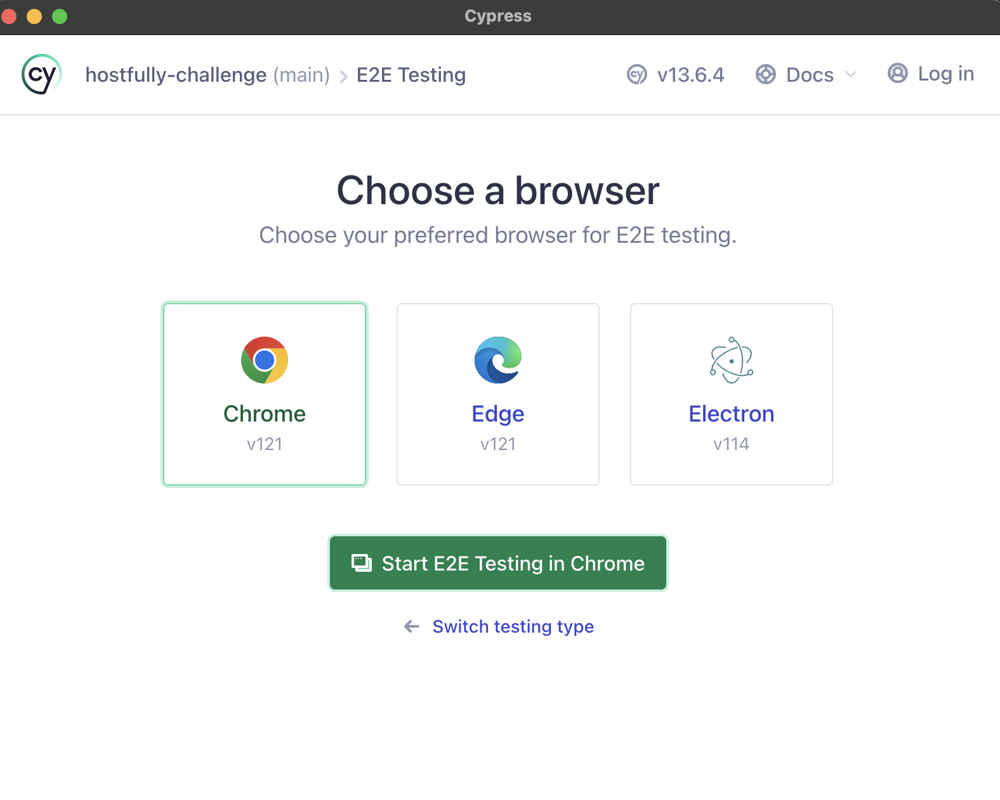
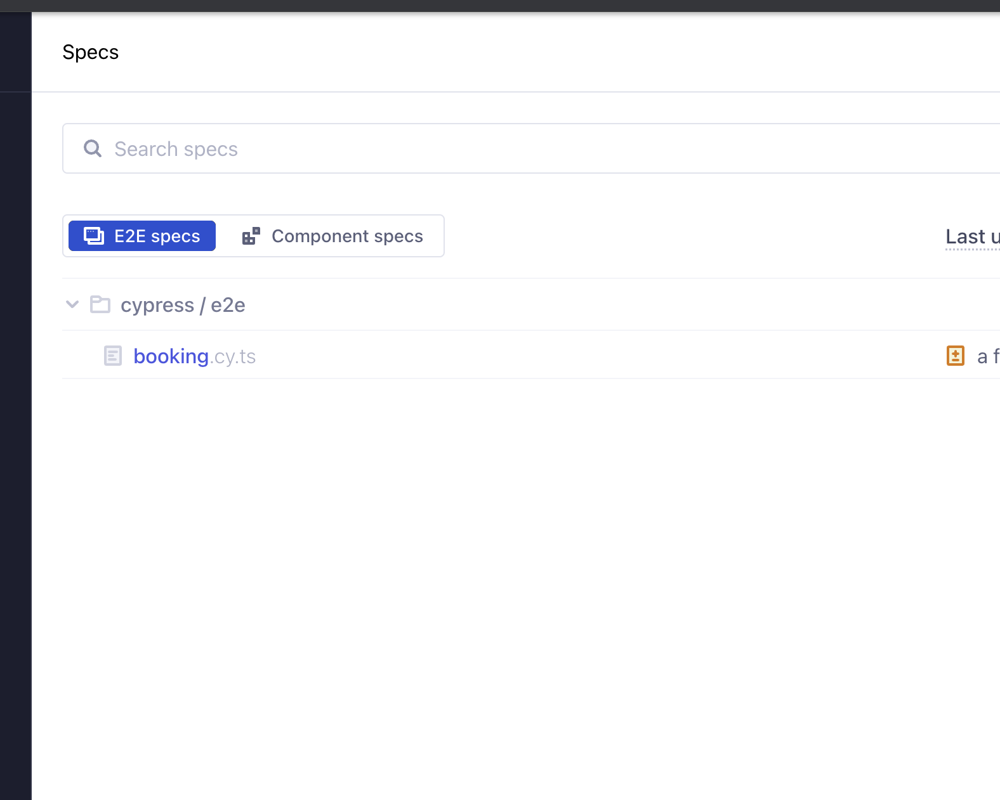

# Technologies 
- React
- Context API
- MUI `material-ui`
- Tailwind CSS
- TypeScript
- Jest
- Cypress
- Moment
- React Testing Library
- React Datepicker

# Getting Started
- Clone the repository
- Install dependencies using yarn install or simply `yarn`
- Run the application with `yarn start`.
- Run unit test with `yarn test`
- Build with `yarn build`

## Cypress Test
- npx cypress open

- select e2e

- run the tests

